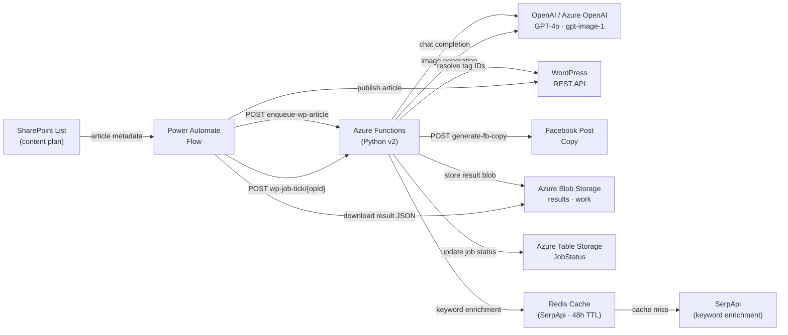

# ksj-wp-func

Automated Latvian-language SEO article generation system for [ksj.lv](https://ksj.lv) — a Microsoft 365 / SharePoint blog. Built on Azure Functions (Python v2 model), it takes article metadata from a SharePoint content plan, calls OpenAI or Azure OpenAI to generate full HTML articles, resolves WordPress tags, and returns the result ready for import via the WP REST API. A parallel pipeline generates Facebook post copy and social header images.

---

## Architecture



---

## HTTP Endpoints

All endpoints are prefixed with `/api/`. Endpoints marked **FUNCTION** require an Azure Function host key (`x-functions-key` header or `code` query parameter). **ANONYMOUS** endpoints are publicly accessible.

| Route | Method | Auth | Description |
|---|---|---|---|
| `/api/ping` | GET | ANONYMOUS | Healthcheck — returns `"pong"` |
| `/api/generate-wp-article` | POST | FUNCTION | Synchronous single-call article generator. Returns full article JSON (title, seoSlug, excerpt, contentHtml, tags, wpTagIds). |
| `/api/enqueue-wp-article` | POST | FUNCTION | Enqueue an async article generation job. Returns `opId`, `statusUrl`, `resultBlobSas`. HTTP 202. |
| `/api/wp-job-status/{opId}` | GET | ANONYMOUS | Read-only status poll — does **not** advance the job. Returns status, phase, progress %. |
| `/api/wp-job-tick/{opId}` | POST | FUNCTION | Advance the job by one tick (called by Power Automate). Phases: `outline → sections → finalize → done`. |
| `/api/generate-fb-copy` | POST | FUNCTION | Generate a structured Latvian Facebook post (HOOK / PAIN / SOLUTION / BENEFIT / CTA / TAGS). |
| `/api/KeywordExtractor` | POST / GET | FUNCTION | Return the single top SEO keyword for article metadata. Supports `use_llm`, `enrich`, `limit` params. |
| `/api/generate-image` | POST | FUNCTION | AI image generation via DALL-E 3 / gpt-image-1. Returns base64 PNG resized to 1200×630 with SEO metadata. |
| `/api/whoami-images` | GET | FUNCTION | Debug — reports which image provider (OpenAI or Azure) is active. |
| `/api/generate-content-plan` | POST | FUNCTION | Generate a monthly content plan (~30 articles) for SharePoint import, avoiding duplicate titles. |

### Async Job Phases

Each `POST /api/wp-job-tick/{opId}` call advances the job one step:

| Phase | What happens |
|---|---|
| `outline` | LLM generates H3 headings + intro HTML |
| `sections` | One section generated per tick (LLM + optional topup if < 95% of target) |
| `finalize` | Assemble, refine, quality-check, resolve WP tag IDs, store result blob |
| `done` | Result in `results/{opId}.json` with 24 h SAS URL |

Alternative **mega** mode generates the entire article in a single LLM call (set `ARTICLE_MODE=mega` or pass `articleMode: "mega"` per request).

---

## Environment Variables

Copy `local.settings.json.example` to `local.settings.json` for local development.

### Required

| Variable | Description |
|---|---|
| `STORAGE` | Azure Storage connection string (Table + Queue + Blob) |
| `WP_API_BASE` | WordPress REST API base URL, e.g. `https://ksj.lv/wp-json/wp/v2` |
| `WP_TOKEN` | WordPress application password token (Base64 `user:password`) |

### OpenAI (direct)

| Variable | Default | Description |
|---|---|---|
| `OAI_API_KEY` | — | OpenAI API key |
| `OAI_BASE_URL` | `https://api.openai.com/v1` | OpenAI-compatible base URL |
| `OAI_MODEL` | `gpt-4o-mini` | Text model name |
| `OAI_IMAGE_MODEL` | `gpt-image-1` | Image model name |

### Azure OpenAI

| Variable | Default | Description |
|---|---|---|
| `AZURE_OPENAI_ENDPOINT` | — | Azure OpenAI resource endpoint URL |
| `AZURE_OPENAI_API_KEY` | — | Azure OpenAI API key |
| `AZURE_OPENAI_DEPLOYMENT` | `gpt-4o-mini` | Text deployment name |
| `AZURE_OPENAI_API_VERSION` | `2024-02-15-preview` | API version for text calls |
| `AZURE_OPENAI_IMAGE_DEPLOYMENT` | — | Image deployment name (DALL-E 3) |
| `AZURE_OPENAI_API_VERSION_IMAGES` | same as above | API version for image calls |

The app auto-detects which provider to use. Set `FORCE_IMAGE_PROVIDER=azure` or `FORCE_IMAGE_PROVIDER=openai` to override image provider selection.

### Image Generation

| Variable | Default | Description |
|---|---|---|
| `FORCE_IMAGE_PROVIDER` | auto | `azure` or `openai` to force a provider |
| `IMAGE_FIT_MODE` | `auto` | `cover`, `contain`, or `auto` for resize strategy |
| `KSJ_SEO_KEYWORD` | `datu sinhronizācija` | Default keyword injected into image alt text |
| `KSJ_SEO_DESC_SUFFIX` | *(LV string)* | Appended to image descriptions |

### Redis (optional — SerpApi caching)

| Variable | Default | Description |
|---|---|---|
| `REDIS_HOST` | — | Redis hostname |
| `REDIS_PORT` | `6380` | Redis port (TLS default) |
| `REDIS_PASSWORD` | — | Redis access key |
| `REDIS_DB` | `0` | Redis database index |

### SerpApi (optional — keyword enrichment)

| Variable | Description |
|---|---|
| `SERPAPI_KEY` | SerpApi API key. Calls are cached in Redis for 48 h; capped at 200/month. |

### Facebook / Links

| Variable | Default | Description |
|---|---|---|
| `BOOK_LINK` | `https://book.jurjans.dev` | Fallback CTA link for FB posts |

---

## Setup

### Prerequisites

- Python 3.11
- [Azure Functions Core Tools v4](https://learn.microsoft.com/azure/azure-functions/functions-run-local)
- Azure Storage account **or** [Azurite](https://github.com/Azure/Azurite) for local emulation

### Local development

```bash
# 1. Clone and create virtual environment
git clone <repo-url>
cd ksj-wp-func
python -m venv .venv
source .venv/bin/activate          # Windows: .venv\Scripts\activate

# 2. Install dependencies
pip install -r requirements.txt

# 3. Configure environment
cp local.settings.json.example local.settings.json
# Edit local.settings.json — fill in STORAGE, OAI_API_KEY (or Azure OpenAI vars),
# WP_API_BASE, WP_TOKEN

# 4. Start Azurite (if not using a real storage account)
azurite --location ./AzuriteConfig --debug ./AzuriteConfig/debug.log

# 5. Run the function app
func start
```

The app will be available at `http://localhost:7071/api/`.

### Deploy to Azure

```bash
# Deploy to an existing Function App
func azure functionapp publish <YOUR_FUNCTION_APP_NAME> --python

# Set app settings (repeat for each variable)
az functionapp config appsettings set \
  --name <YOUR_FUNCTION_APP_NAME> \
  --resource-group <RG> \
  --settings "OAI_API_KEY=sk-..." "WP_API_BASE=https://..." "WP_TOKEN=..."
```

---

## Tech Stack

| Layer | Technology |
|---|---|
| Runtime | Python 3.11 · Azure Functions v4 (Python v2 programming model) |
| AI / LLM | OpenAI GPT-4o / Azure OpenAI — text generation and image synthesis |
| Image processing | Pillow — resize / crop to 1200×630 social header |
| Storage | Azure Blob Storage (results + work-in-progress state) |
| Job tracking | Azure Table Storage (JobStatus) |
| Queue | Azure Queue Storage (wpjobs — defined, reserved for future use) |
| Caching | Redis — SerpApi response cache (48 h TTL, 200 calls/month guard) |
| Keyword extraction | YAKE (yet another keyword extractor) + SerpApi enrichment |
| HTML parsing | BeautifulSoup4 |
| DOCX conversion | mammoth |
| WordPress | WP REST API — tag resolution and article publishing |
| Orchestration | Power Automate — drives the tick-by-tick async job loop |

---

## Output JSON Schema

A completed job produces a JSON blob at `results/{opId}.json` with the following fields:

```json
{
  "title": "Article title",
  "seoSlug": "article-seo-slug",
  "excerpt": "Short excerpt for WP",
  "category": "SharePoint",
  "tags": ["Tag A", "Tag B"],
  "tagSlugs": ["tag-a", "tag-b"],
  "wpTagIds": [42, 17],
  "focusKeyword": "primary seo keyword",
  "contentHtml": "<h2>...</h2><p>...</p>..."
}
```

`contentHtml` uses only allowed tags: `h2`, `h3`, `p`, `ul`, `ol`, `li`, `strong`, `em`, `code`, `pre`, `blockquote`, `br`.
